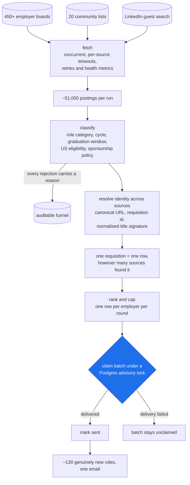

# job-discovery

Finds early-career roles that are actually open to you, and mails them once.

It reads 450+ employer job boards, 20 community-maintained lists and LinkedIn's
guest search, then filters roughly 51,000 postings a run down to about 130 that
are genuinely new, genuinely early-career, and genuinely in the United States.
One requisition becomes one row in one email, however many sources found it.

Two readers are served from the same code. The **technical** profile looks for
software, data and hardware internships and new-grad roles. The **finance**
profile looks for investment management, equity research, private and public
markets, quant trading and corporate finance, and deliberately excludes
commercial banking. They run separately, against separate databases, so one
reader's send history never suppresses the other's mail.

## What it does on a run

1. **Fetch** every configured source concurrently, with per-source timeouts,
   retries and health metrics. A source that fails is reported, not fatal.
2. **Classify** each posting: role category, recruiting cycle, graduation
   window, US work eligibility, and whether the posting states a sponsorship
   policy. Every rejection carries a reason, so the funnel is auditable.
3. **Resolve identity** across sources. The same job found on a company's
   Greenhouse board, a GitHub list and LinkedIn is one requisition, matched on
   canonical URL, requisition id, and a normalised title signature.
4. **Rank and cap**, dealing one row per employer per round so a single company
   with nineteen locations cannot consume the whole digest.
5. **Send exactly once**, claiming a batch under a Postgres advisory lock and
   confirming it only after delivery.

## The pipeline



A source that fails is reported, not fatal. The send is confirmed only after
delivery, which is what makes "exactly once" true rather than aspirational.

## Running it

Requires Node 22+. Postgres is needed only by `migrate` and `pipeline`; both dry
runs below store nothing and so need no database.

```bash
npm install
npm run build
npm run test:unit
```

The CLI validates its whole environment when it loads, before it looks at which
verb you typed, so four variables have to be set for any command at all -
including `--help`. Three of them are the recipient and the Notion ledger ids,
which a dry run never reads and never contacts. Placeholders are the honest
values there, and are what the two commands below were run with:

```bash
export EMAIL_TO=you@example.com
export NOTION_DATABASE_ID=unused-for-a-dry-run
export NOTION_DATA_SOURCE_ID=unused-for-a-dry-run
# The watchlist lives beside the project when deployed and inside it in a
# checkout, so a checkout has to say where it is.
export WATCHLIST_PATH=automation/job-company-watchlist.md
```

```bash
# Offline. Runs the whole classify → identity → rank → cap path over the
# committed fixtures, in seconds, touching no network: 7 raw, 5 accepted.
node dist/cli.js dry-run --fixtures

# Every free source for real, rendering a digest without sending or storing
# anything. Around 70,000 postings, about six minutes, no credentials.
node dist/cli.js dry-run --live-free

# The real thing: stores, dedupes against send history, prepares a batch.
# This one needs Postgres and a real DATABASE_URL.
node dist/cli.js pipeline
```

`.env.example` documents every remaining setting. It is read by
`docker compose`, not by the CLI - there is no dotenv call in `src/config.ts` -
so for a CLI run export what you need rather than writing a `.env` and expecting
it to be picked up.

`JOB_PROFILE=finance` switches profiles. `config/` holds the sources, the
company aliases and the sponsorship patterns; `migrations/` holds ordered,
idempotent SQL that is safe to re-run.

## Deploying it

The pipeline runs under n8n every three hours at minute 15, with Postgres for
send history. The finance profile runs every eight hours at minute 37, against a
separate database, so one reader's send history never suppresses the other's mail.

Individual sources run slower than that tick where fetching them is expensive:
Greenhouse and the community lists every six hours, LinkedIn every twelve, Apify
every twenty-four, page watches daily.

```bash
# local or a single box
docker compose up -d            # postgres, migrate, n8n
docker compose ps
docker compose logs --since=4h n8n postgres
```

For a hosted run, `railway.json` builds `Dockerfile.n8n` with a `/healthz`
check and `restartPolicyType: ALWAYS`:

```bash
railway up
railway service status --service n8n --json
```

Migrations in `migrations/` are ordered and idempotent, so they are safe to
re-run; a healthy start logs a `job_pipeline_migrations_complete` event. Keep
Postgres private, and leave `N8N_IMPORT_WORKFLOWS_ON_START` off except for the
one-time workflow import. Full runbook, including source-health triage, is in
[OPERATIONS.md](OPERATIONS.md).

## Contributing

The most useful contribution is a job board we do not read yet. See
[CONTRIBUTING.md](CONTRIBUTING.md) for how to find one, how to verify it is
really the company it claims to be, and how to add it.

Issues labelled `good first issue` are real gaps with a reproduction attached.

## Licence

MIT. See [LICENSE](LICENSE).
